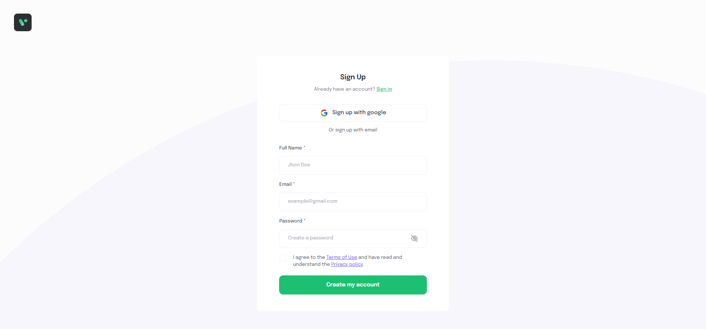
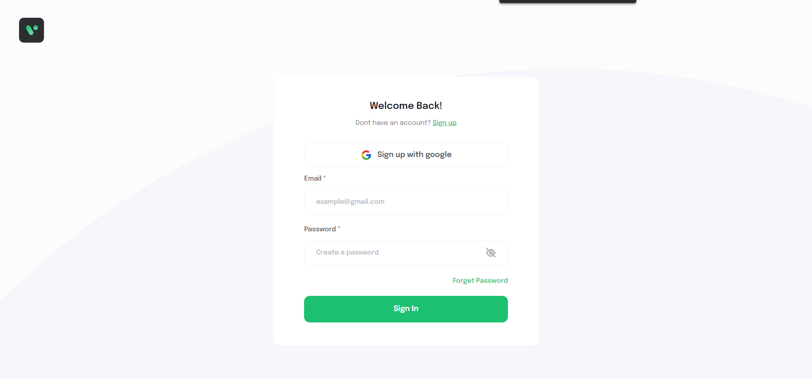

# Getting Started with Create React App and Redux

- `npm install`
- `npm start`
- Open new tab of Terminal and run command `cd server`
- Run command `npm start` to start Server

# Screenshoot

- Sign Up Page

- Sign In Page

